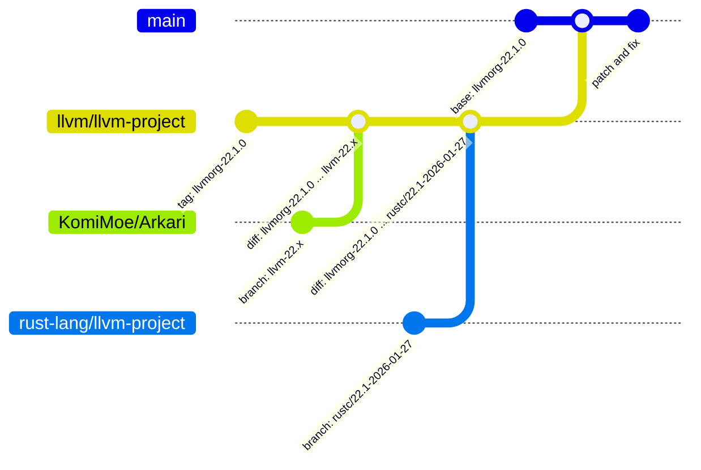

# Rust LLVM + Arkari obfuscation module
Merge [rust-lang/llvm-project](https://github.com/rust-lang/llvm-project) and [komimoe/Arkari](https://github.com/komimoe/Arkari)

<br>  



### Release Targets  
- Windows 64-bit  
- Linux 64-bit  

<br>  
<br>  

# 🕹️ HOW TO USE

## About `RUSTFLAGS`  
- `--irobf` : Turn obfuscation module on  
- `--irobf-indbr` : Indirect jumps with encrypted jump targets  
- `--irobf-icall` : Indirect function calls with encrypted target function addresses  
- `--irobf-indgv` : Indirect global variable references with encrypted variable addresses  
- `--irobf-cse` : C-string encryption  
- `--irobf-fla` : Control-flow flattening (procedure-related)  
- `--irobf-cie` : Integer constant encryption  
- `--irobf-cfe` : Floating-point constant encryption  

### Linux:  
1. Link the toolchain  
```bash
rustup toolchain link <toolchain name> </path/to/extracted/stage1>
```
2. Run with obfuscation `RUSTFLAGS`  
```bash
RUSTFLAGS="-Cllvm-args=--irobf -Cllvm-args=--irobf-indbr -Cllvm-args=--irobf-icall -Cllvm-args=--irobf-indgv -Cllvm-args=--irobf-cse -Cllvm-args=--irobf-fla -Cllvm-args=--irobf-cie -Cllvm-args=--irobf-cfe" \
cargo +<toolchain name> build --release
```

### Windows:  
1. Link the toolchain  
```cmd
rustup toolchain link <toolchain name> <C:\path\to\extracted\stage1>
```

2. Run with obfuscation `RUSTFLAGS`  
```cmd
set RUSTFLAGS=-Cllvm-args=--irobf -Cllvm-args=--irobf-indbr -Cllvm-args=--irobf-icall -Cllvm-args=--irobf-indgv -Cllvm-args=--irobf-cse -Cllvm-args=--irobf-fla -Cllvm-args=--irobf-cie -Cllvm-args=--irobf-cfe
cargo +<toolchain name> build --release
set RUSTFLAGS=
```

## 🚧 Issue  

### 💥 Incompatibility  
Maybe some obfuscation flag can cause incompatibility with the crate used in the project. <br>
- Using the `--irobf-cie` flag with the `nu-plugin-engine` crate compile failed. (out of memory)  
- Using the `--irobf-fla` flag with the `windows-rs` crate compile failed.  
- Using the `--irobf-fla` flag with the `rand` crate compile failed. (exit code: 0xc0000005, STATUS_ACCESS_VIOLATION)  
- Using the `--irobf-fla` flag with the `clap` crate compile failed. (exit code: 0xc0000005, STATUS_ACCESS_VIOLATION) (seems like `anstream` `clap_lex` `proc-macro2` `windows-sys` ...and more is not compatible)  

<br>  
<br>  

---
# 🛠️ How to Build

- On Linux (with ninja)
```bash
cmake -GNinja ../llvm -DCMAKE_INSTALL_PREFIX="./Release" -DLLVM_ENABLE_PROJECTS="clang;lld;" -DLLVM_TARGETS_TO_BUILD="X86" -DLLVM_INSTALL_UTILS=ON -DLLVM_INCLUDE_TESTS=OFF -DLLVM_BUILD_TESTS=OFF -DLLVM_INCLUDE_BENCHMARKS=OFF -DLLVM_BUILD_BENCHMARKS=OFF -DLLVM_INCLUDE_EXAMPLES=OFF -DLLVM_ENABLE_BACKTRACES=OFF -DLLVM_BUILD_DOCS=OFF -DBUILD_SHARED_LIBS=OFF -DCMAKE_BUILD_TYPE=Release
```

- On Windows (with MSBuild)
```bash
cmake ../llvm -DCMAKE_INSTALL_PREFIX="./Release" -DLLVM_ENABLE_PROJECTS="clang;lld;" -DLLVM_TARGETS_TO_BUILD="X86" -DLLVM_INSTALL_UTILS=ON -DLLVM_INCLUDE_TESTS=OFF -DLLVM_BUILD_TESTS=OFF -DLLVM_INCLUDE_BENCHMARKS=OFF -DLLVM_BUILD_BENCHMARKS=OFF -DLLVM_INCLUDE_EXAMPLES=OFF -DLLVM_ENABLE_BACKTRACES=OFF -DLLVM_BUILD_DOCS=OFF -DBUILD_SHARED_LIBS=OFF -DCMAKE_BUILD_TYPE=Release -DCMAKE_MSVC_RUNTIME_LIBRARY=MultiThreaded
```

## Used Version
- [repo `rust-lang/llvm-project` branch `rustc/22.1-2026-01-27`](https://github.com/rust-lang/llvm-project/tree/rustc/22.1-2026-01-27)
- [repo `komimoe/Arkari` tag `llvm-22.x`](https://github.com/komimoe/Arkari/tree/llvm-22.x)

## Used Config
`config.toml` for building `rust-lang/rust`

> Replace `"target-triple"` by wanted target triple  
> (e.g. "x86_64-unknown-linux-gnu" or "x86_64-pc-windows-msvc" etc.)  

```toml
change-id = 999999

[llvm]
targets          = "X86"
download-ci-llvm = false
link-shared      = false
ninja            = true

[build]
build  =  "target-triple"
host   = ["target-triple"]
target = ["target-triple"]
extended = false
submodules = true

[target.target-triple]
llvm-config   = "/path/to/-DLLVM_INSTALL_PREFIX/bin/llvm-config"
```

<br>  
<br>  
<br>  

## 💀 How this project was built...

> Check for [`rust-ollvm-20.1.8`'s README](https://github.com/ParkSnoopy/rust_llvm-arkari_ollvm/blob/rust-ollvm-20.1.8/README.md#-how-this-project-was-built) for detailed informations.

---

## ⭐ Star History

<a href="https://www.star-history.com/#ParkSnoopy/rust_llvm-arkari_ollvm&type=date&legend=top-left">
 <picture>
   <source media="(prefers-color-scheme: dark)" srcset="https://api.star-history.com/svg?repos=ParkSnoopy/rust_llvm-arkari_ollvm&type=date&theme=dark&legend=top-left" />
   <source media="(prefers-color-scheme: light)" srcset="https://api.star-history.com/svg?repos=ParkSnoopy/rust_llvm-arkari_ollvm&type=date&legend=top-left" />
   
 </picture>
</a>
